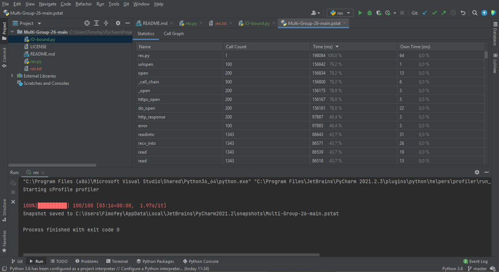
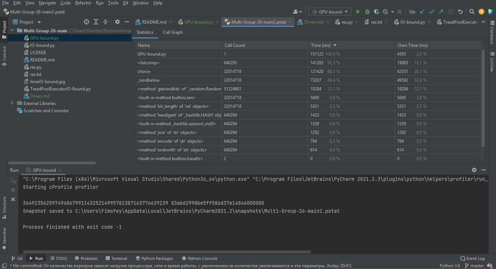

Замерил время выполнения синхронной проверки ссылок. (IO-bound.py)

Переписал код, используя ThreadPoolExecutor. (TreadPoolExecutorIO-Bound.py)
Изменяя количество воркеров, заметил, что от них зависит загрузка процессора, сети и время работы, с увеличением их количества увеличиваются и эти параметры.

Замерил время генерации одной монеты. (GPU-bound.py)

Ускорил код, используя ProcessPoolExecutor. (GPU-boundWithPPE.py)
Изменяя количество воркеров, заметил, что от них зависит загрузка процессора и время работы, с увеличением их количества увеличиваются и эти параметры.
Убедился в том, что так как задача CPU bound, наращивать количество воркеров, большее количества ядер, бесполезно.